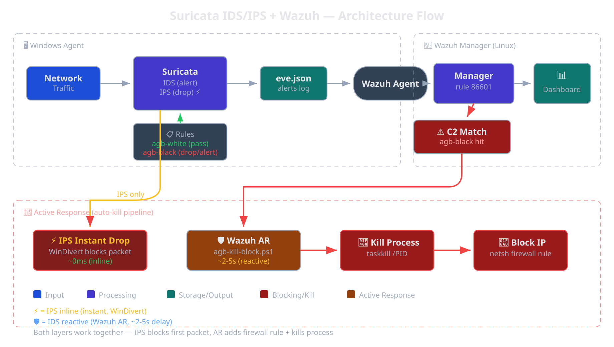

# Suricata for Windows — IDS/IPS + Wazuh Integration
---

Self-contained Suricata deployment for Windows with Wazuh SIEM integration, custom whitelist/blacklist, and auto-kill Active Response.

Windows စက်များတွင် Suricata ကို Wazuh SIEM နှင့် ချိတ်ဆက်ပြီး whitelist/blacklist နှင့် auto-kill Active Response အပါအဝင် အလိုအလျောက် deploy လုပ်ပေးသော script များ ဖြစ်ပါသည်။



---

## 📦 Files / ဖိုင်များ

| File | Description / ရှင်းလင်းချက် |
| --- | --- |
| `agb-full-setup.ps1` | **IDS Installer** — Suricata IDS + Wazuh wiring + ET Open rules + agb rules + Active Response (GitHub raw) |
| `agb-full-setup-cdn.ps1` | ↑ Same — jsDelivr CDN version (GitHub rate limit ရှောင်ရှား) |
| `build-suricata-ips.ps1` | **IPS Builder** — Suricata IPS source build with WinDivert inline blocking (GitHub raw) |
| `suricata-rate-limit-bypass.ps1` | ↑ Same — jsDelivr CDN version |
| `agb-full-uninstall.ps1` | IDS uninstaller (deep clean) |
| `uninstall-all-suricata.ps1` | IDS + IPS both uninstall |
| `agb-white.rules` | Pass rules — known-good traffic (edit on GitHub) |
| `agb-black.rules` | Alert rules — known-bad C2 IPs/domains (edit on GitHub) |
| `agb-heuristics.rules` | DGA/exfil/JA3 heuristic detection (alert-only) |
| `deploy-agb-rules.ps1` | Daily rule pull-deploy (scheduled task calls this) |
| `fix-eve-stats-overflow.ps1` | Hotfix for pre-existing installs (stats overflow bug) |
| `Test-SuricataAlerts.ps1` | On-demand alert test |
| `Test-SuricataIPS-Rules.ps1` | IPS rule test |
| `install-suricata-ips-service.ps1` | Register IPS as Windows service (separate from build) |
| `wazuh-manager/` | Manager-side rules, CDB lists, AR config |

---

## 🚀 Quick Start / အမြန်စတင်ရန်

> **⚠️ Administrator PowerShell လိုအပ်ပါသည်** (Win+X → Terminal (Admin))

### Step 1: IDS Install (Base Setup)

Suricata IDS + Wazuh agent wiring + rules + Active Response အကုန်သွင်းပေးပါသည်။

**CDN version (recommended / အကြံပြု):**
```powershell
[Net.ServicePointManager]::SecurityProtocol='Tls12';iwr https://cdn.jsdelivr.net/gh/yekyawhan/wazuh@git-home/suricata-win/agb-full-setup-cdn.ps1 -UseBasicParsing | iex
```

**GitHub raw version (429 error ဖြစ်နိုင်):**
```powershell
[Net.ServicePointManager]::SecurityProtocol='Tls12';iwr https://raw.githubusercontent.com/yekyawhan/wazuh/git-home/suricata-win/agb-full-setup.ps1 -UseBasicParsing | iex
```

### Step 2: IPS Build (Optional — Inline Blocking)

IDS ပေါ်မှာ ထပ်ထည့်ရတယ်။ Suricata ကို source ကနေ compile လုပ်ပြီး WinDivert နဲ့ real-time packet blocking ရရှိမယ်။ **~20-60 min ကြာမယ်။**

**CDN version (recommended):**
```powershell
[Net.ServicePointManager]::SecurityProtocol='Tls12';iwr https://cdn.jsdelivr.net/gh/yekyawhan/wazuh@git-home/suricata-win/suricata-rate-limit-bypass.ps1 -UseBasicParsing | iex
```

**GitHub raw version:**
```powershell
[Net.ServicePointManager]::SecurityProtocol='Tls12';iwr https://raw.githubusercontent.com/yekyawhan/wazuh/git-home/suricata-win/build-suricata-ips.ps1 -UseBasicParsing | iex
```

---

## 🔄 Install Order / သွင်းရမည့် အစီအစဉ်

```
Step 1: agb-full-setup-cdn.ps1     ← IDS base (MUST run first / အရင်သွင်းရမည်)
  ├─ Npcap driver
  ├─ Suricata MSI (IDS, alert-only)
  ├─ ET Open + agb rules
  ├─ Wazuh agent wiring
  ├─ Active Response scripts
  └─ Daily refresh scheduled tasks

Step 2: suricata-rate-limit-bypass.ps1   ← IPS build (optional / ရွေးချယ်)
  ├─ MSYS2 + Rust toolchain
  ├─ Suricata source compile with WinDivert
  ├─ Separate deploy: C:\SuricataIPS\
  ├─ Own rules + yaml
  ├─ Wazuh wiring (if agent present)
  └─ SuricataIPS service (optional)
```

**⚠️ Step 2 ကို Step 1 မသွင်းဘဲ တစ်ခုတည်း run လို့မရပါ။** IDS base setup (Wazuh wiring, rules, Active Response) ကို Step 1 က လုပ်ပေးတာ ဖြစ်ပါသည်။

---

## 🛡️ IDS vs IPS — ဘာကွာသလဲ?

| | IDS (Step 1) | IPS (Step 2) |
| --- | --- | --- |
| **Mode** | Passive (Npcap) | Inline (WinDivert) |
| **Can block?** | ❌ Alert only → Wazuh AR kills later | ✅ Drops packet instantly |
| **Install** | MSI (fast) | Source compile (~20-60 min) |
| **Deploy path** | `C:\Program Files\Suricata\` | `C:\SuricataIPS\` |
| **Risk** | Low — just watches | Higher — sits in traffic path |
| **Coexist?** | Yes — both run side by side | Yes — separate service |

---

## 🔧 Uninstall / ဖြုတ်ရန်

**IDS only:**
```powershell
[Net.ServicePointManager]::SecurityProtocol='Tls12';iwr https://cdn.jsdelivr.net/gh/yekyawhan/wazuh@git-home/suricata-win/agb-full-uninstall.ps1 -UseBasicParsing | iex
```

**IDS + IPS both:**
```powershell
[Net.ServicePointManager]::SecurityProtocol='Tls12';iwr https://cdn.jsdelivr.net/gh/yekyawhan/wazuh@git-home/suricata-win/uninstall-all-suricata.ps1 -UseBasicParsing | iex
```

---

## ✅ Verify / စစ်ဆေးရန်

```powershell
Get-Service Suricata         # IDS service
Get-Service SuricataIPS      # IPS service (if installed)
Get-Service WazuhSvc         # Wazuh agent
Get-ScheduledTask -TaskName 'AGB-Suricata-*'   # Daily refresh tasks
```

Healthy output:
```
rules        : ~50000 loaded
Suricata svc : Running
Wazuh agent  : Running
manager link : Established
```

---

## 🧪 Test Alerts

```powershell
[Net.ServicePointManager]::SecurityProtocol='Tls12';iwr https://cdn.jsdelivr.net/gh/yekyawhan/wazuh@git-home/suricata-win/Test-SuricataAlerts.ps1 -UseBasicParsing -OutFile $env:TEMP\Test-SuricataAlerts.ps1;powershell -ExecutionPolicy Bypass -File $env:TEMP\Test-SuricataAlerts.ps1
```

Manager side: `sudo grep WAZUH-TEST /var/ossec/logs/alerts/alerts.json`

---

## 📋 CDN vs GitHub Raw

| | GitHub Raw | jsDelivr CDN |
| --- | --- | --- |
| **Rate limit** | ⚠️ 429 Too Many Requests | ✅ No limit |
| **Cache** | Real-time | ~12hr cache |
| **Private repo** | ✅ Works | ❌ Public only |
| **Script** | `agb-full-setup.ps1` / `build-suricata-ips.ps1` | `agb-full-setup-cdn.ps1` / `suricata-rate-limit-bypass.ps1` |

**jsDelivr cache ကို force refresh လုပ်ချင်ရင်:**
```
https://purge.jsdelivr.net/gh/yekyawhan/wazuh@git-home/suricata-win/<filename>
```

---

## 📖 Detailed Guide / အသေးစိတ် လမ်းညွှန်

Parameters, troubleshooting, manager-side setup, Active Response config, rule customization, Tor blocking, WinDivert gotchas, and more:

👉 **[guide.md](guide.md)**
