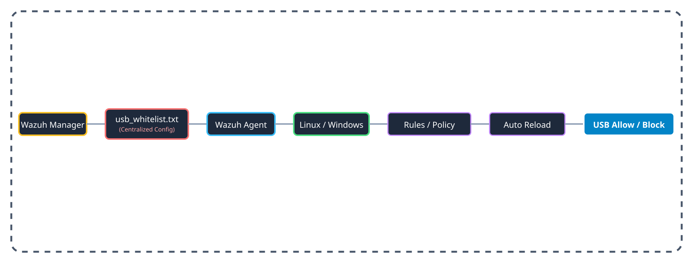

# USB Unauthorized Device Monitoring & Blocking (Hybrid: Wazuh Centralized + OS-Native)

Enterprise-grade USB control. A single **whitelist** is managed centrally on the Wazuh Manager and distributed to every agent via **Wazuh Centralized Configuration**. Each agent enforces it with **OS-native policy** — **GPO** on Windows, **udev** on Linux — so the block keeps working even when the endpoint is offline. Wazuh handles the config sync and the alerting.

Windows နှင့် Linux စက်များတွင် ခွင့်ပြုချက်မရှိသော USB များကို OS-Native Policy (GPO / udev) ဖြင့် ပိတ်ပင်ပြီး (offline မှာပါ အလုပ်လုပ်သည်)၊ Manager တစ်နေရာတည်းမှ USB whitelist ကို ထိန်းချုပ်ဖြန့်ဝေနိုင်သည့် (centralized) စနစ်ဖြစ်ပါသည်။



---

## 📦 Architecture

- **Centralized control (Manager):** one `usb_whitelist.txt` on the Wazuh Manager.
- **Distribution (Wazuh sync):** Wazuh pushes that file to every agent automatically.
- **Enforcement (OS):** an agent-side script reads the synced file on a schedule and applies it to Local GPO (Windows) or `udev` (Linux). Blocking is at the OS level — 100% offline-capable.
- **Alerting (Wazuh):** the agent reports sync results and OS block events to the Manager.

---

## 🚀 Quick Install (one-line) / အမြန်တပ်ဆင်ရန်

### 1. Onboard an endpoint (one time, per agent)
Deploys the sync script, enables the required setting, restarts the agent, and runs it once. **Run as Administrator (Windows) / root (Linux).**

**Windows** — GitHub raw (recommended, always current):
```powershell
$iwr='https://raw.githubusercontent.com/yekyawhan/wazuh/git-home/usb-unauthorized/releases/usb-unauthorized-windows-v2.zip';$tmp=(Join-Path $env:TEMP ([guid]::NewGuid()))+'.zip';[Net.ServicePointManager]::SecurityProtocol='Tls12';iwr $iwr -OutFile $tmp -UseBasicParsing;New-Item -ItemType Directory -Path 'C:\ProgramData\Wazuh' -Force | Out-Null;Expand-Archive $tmp -DestinationPath 'C:\ProgramData\Wazuh' -Force;$ps1=Get-ChildItem -Path 'C:\ProgramData\Wazuh' -Recurse -Filter 'install_usb_sync_windows.ps1' -ErrorAction SilentlyContinue | Select-Object -First 1 -ExpandProperty FullName;if(-not $ps1){Write-Error 'install_usb_sync_windows.ps1 not found in expanded zip';exit 1};Start-Process powershell -Verb RunAs -ArgumentList '-NoProfile','-ExecutionPolicy','Bypass','-File',$ps1
```

Windows — CDN (jsdelivr, may serve stale for ~12h):
```powershell
$iwr='https://cdn.jsdelivr.net/gh/yekyawhan/wazuh@git-home/usb-unauthorized/releases/usb-unauthorized-windows-v2.zip'
```

The one-liner **finds the install script anywhere in the expanded zip tree** (works whether the zip has a wrapper folder or not). Just substitute the `$iwr` value.

**Linux** — CDN (recommended):
```bash
curl -sL https://cdn.jsdelivr.net/gh/yekyawhan/wazuh@git-home/usb-unauthorized/enable-usb-sync.sh | sudo bash
```
Linux — GitHub raw:
```bash
curl -fsSL https://raw.githubusercontent.com/yekyawhan/wazuh/git-home/usb-unauthorized/v2/install_usb_sync_linux.sh | sudo bash
```

### 2. Find a device's ID (to add it to the whitelist)
Prints a clean, de-duplicated list (hubs hidden).

**Windows** — CDN / raw:
```powershell
[Net.ServicePointManager]::SecurityProtocol='Tls12';iwr https://cdn.jsdelivr.net/gh/yekyawhan/wazuh@git-home/usb-unauthorized/get_usb_info.ps1 -UseBasicParsing | iex
```
```powershell
[Net.ServicePointManager]::SecurityProtocol='Tls12';iwr https://raw.githubusercontent.com/yekyawhan/wazuh/git-home/usb-unauthorized/get_usb_info.ps1 -UseBasicParsing | iex
```
**Linux** — CDN / raw:
```bash
curl -sL https://cdn.jsdelivr.net/gh/yekyawhan/wazuh@git-home/usb-unauthorized/get_usb_info.sh | bash
```
```bash
curl -fsSL https://raw.githubusercontent.com/yekyawhan/wazuh/git-home/usb-unauthorized/get_usb_info.sh | sudo bash
```

> CDN (`cdn.jsdelivr.net`) has no rate limit but caches for ~12h; GitHub raw is always current but limited to ~60 requests/hour per IP. Use CDN normally, raw when you need the newest version immediately.

Full manager + endpoint walkthrough: 👉 **[Detailed Setup Guide](assets/guide.md)**

---

## 📋 Files / ဖိုင်များ

| File | Description / ရှင်းလင်းချက် |
| --- | --- |
| `usb_whitelist.txt` | Central list of allowed USB IDs (lives on the Manager). |
| `agent.conf.snippet` | Manager config that tells agents to run the sync on a schedule. |
| `v2/install_usb_sync_linux.sh` | Linux V2 one-shot installer (systemd + udev + watcher). |
| `v2/hybrid_sync_usb_linux_v2.sh` | Linux V2 sync engine. |
| `enable-usb-sync.sh` | **Linux one-time endpoint onboarding** — deploy + enable + restart. |
| `enable-usb-sync.ps1` | Windows V1 onboarding helper (legacy). |
| `hybrid_sync_usb_linux.sh` | Linux V1 sync (legacy, superseded by `v2/`). |
| `get_usb_info.ps1` / `.sh` | Helper to find a device's VID/PID (clean output). |
| `windows/` | Windows V2 — modules, installer, uninstaller, tests, docs. |
| `windows/install.cmd` | Windows V2 one-line bootstrap (auto-elevates). |
| `releases/usb-unauthorized-windows-v2.zip` | Windows V2 offline-installable release archive. |
| `assets/guide.md` | Detailed setup guide. |
| `assets/flow.svg` | Architecture diagram. |
